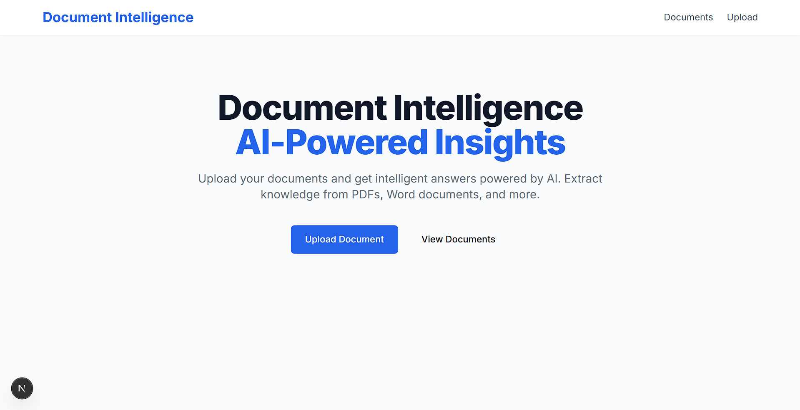
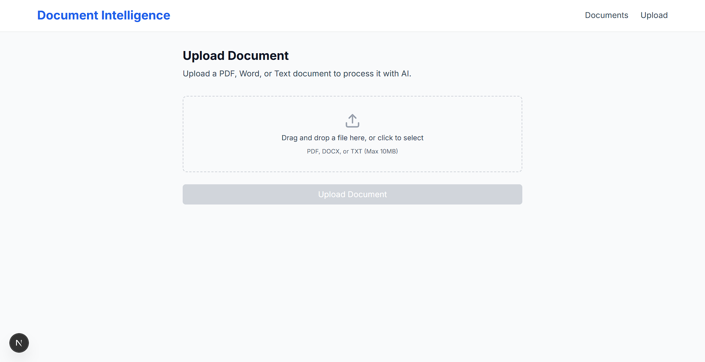
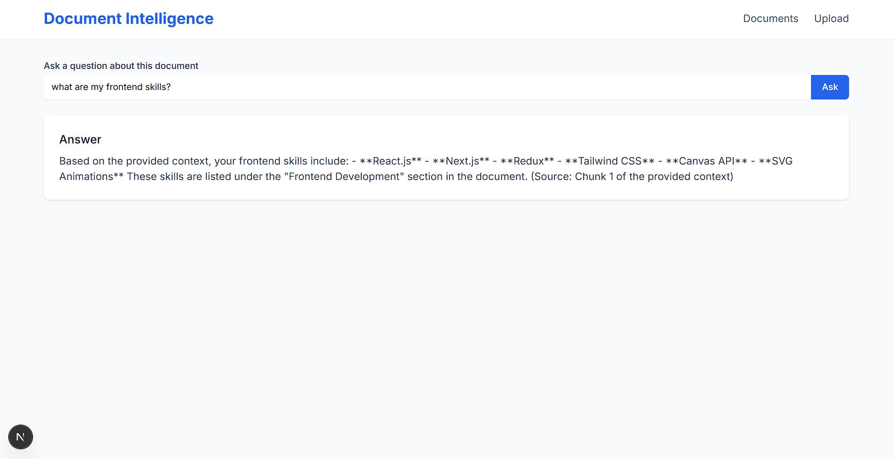

# DocIntel Frontend

A Next.js-based document intelligence application that allows users to upload documents, view them in a dashboard, and ask questions about their content using AI-powered Q&A functionality.

## 📸 Screenshots

### Dashboard View

*Document dashboard showing uploaded files with metadata and status indicators*

### Upload Interface

*Drag-and-drop file upload interface*

### Q&A Interface

*Question and answer interface for document interaction*

## 🏗️ Project Structure

```
frontend/docintel-frontend
├── package.json                 # Project dependencies and scripts
├── next.config.js              # Next.js configuration
├── tailwind.config.js          # Tailwind CSS configuration
├── screenshots/ 
│   ├── dashboard.png            
│   ├── upload.png               
│   ├── qa.png               
├── app/                        # Next.js 13+ App Router
│   ├── layout.tsx              # Root layout component
│   ├── page.tsx                # Home page
│   ├── api/
│   │   └── client.ts           # API client configuration and methods
│   ├── dashboard/              # Documents dashboard
│   │   ├── page.tsx            # Dashboard page component
│   │   └── components/
│   │       ├── DocumentCard.tsx    # Individual document card
│   │       └── DocumentList.tsx    # List of documents
│   ├── upload/                 # Document upload functionality
│   │   ├── page.tsx            # Upload page
│   │   └── components/
│   │       └── UploadForm.tsx  # File upload form
│   ├── qa/                     # Question & Answer functionality
│   │   ├── page.tsx            # Q&A page
│   │   └── components/
│   │       └── QASection.tsx   # Q&A interface
│   └── components/             # Shared components
│       ├── Header.tsx          # Application header
│       ├── Layout.tsx          # Main layout wrapper
│       ├── LoadingSpinner.tsx  # Loading indicator
│       └── StatusBadge.tsx     # Document status indicator
├── lib/                        # Utility libraries
│   ├── constants.ts            # Application constants
│   └── types.ts                # TypeScript type definitions
└── styles/
    └── globals.css             # Global CSS styles
```

## 🚀 Getting Started

### Prerequisites

- Node.js (version 18 or higher)
- npm or yarn package manager
- Backend API running on `http://127.0.0.1:8000`

### Installation

1. Clone the repository and navigate to the frontend directory
2. Install dependencies:
   ```bash
   npm install
   ```

3. Start the development server:
   ```bash
   npm run dev
   ```

4. Open [http://localhost:3000](http://localhost:3000) to view the application

### Available Scripts

- `npm run dev` - Start development server with Turbopack
- `npm run build` - Build the application for production
- `npm run start` - Start the production server
- `npm run lint` - Run ESLint for code quality checks

## 🛠️ Tech Stack

### Core Technologies
- **Next.js 15.3.2** - React framework with App Router
- **React 18** - UI library
- **TypeScript** - Type-safe JavaScript
- **Tailwind CSS** - Utility-first CSS framework

### Key Dependencies
- **axios** - HTTP client for API requests
- **date-fns** - Date formatting utilities
- **react-dropzone** - File upload component
- **react-hot-toast** - Toast notifications
- **react-icons** - Icon library

## 📋 Features

### 📁 Dashboard
- View all uploaded documents in a grid layout
- Display document metadata (file type, size, page count, creation date)
- Show processing status with visual badges
- Navigate to Q&A interface for each document

### 📤 Upload
- Drag-and-drop file upload interface
- Support for multiple document formats
- Real-time upload progress and status feedback

### ❓ Q&A Interface
- Ask questions about uploaded documents
- AI-powered answers based on document content
- Real-time question processing with loading states

## 🔧 API Integration

The application connects to a backend API running on `http://127.0.0.1:8000/api` with the following endpoints:

- `POST /documents/upload/` - Upload new documents
- `GET /documents/` - Fetch all documents
- `GET /documents/{id}/` - Get specific document details
- `POST /ask/` - Ask questions about documents

## 🎨 UI Components

### Shared Components
- **Header** - Navigation and branding
- **Layout** - Application wrapper with consistent styling
- **LoadingSpinner** - Reusable loading indicator
- **StatusBadge** - Document processing status display

### Page-Specific Components
- **DocumentCard** - Individual document display with metadata
- **DocumentList** - Grid layout for multiple documents
- **UploadForm** - File upload interface with drag-and-drop
- **QASection** - Question input and answer display

## 🔄 State Management

The application uses React's built-in state management:
- `useState` for component-level state
- `useSearchParams` for URL parameter handling
- `Suspense` for loading states with server components

## 🎯 Development Notes

### Error Handling
- Comprehensive error boundaries for failed API requests
- User-friendly error messages with retry options
- Toast notifications for operation feedback

### Performance
- Server-side rendering where appropriate
- Lazy loading with React Suspense
- Optimized image and asset loading

### Accessibility
- Semantic HTML structure
- Proper ARIA labels and roles
- Keyboard navigation support

## 🚀 Deployment

1. Build the application:
   ```bash
   npm run build
   ```

2. Start the production server:
   ```bash
   npm run start
   ```

3. Ensure the backend API is accessible from your deployment environment

## 🔧 Configuration

### Environment Variables
Create a `.env.local` file for environment-specific configurations:
```
NEXT_PUBLIC_API_BASE_URL=http://127.0.0.1:8000/api
```

### API Configuration
Update the `API_BASE_URL` in `app/api/client.ts` to match your backend deployment.

## 📱 Responsive Design

The application is fully responsive with:
- Mobile-first design approach
- Breakpoint-specific layouts (md, lg)
- Touch-friendly interfaces for mobile devices

## 🤝 Contributing

1. Follow the established code structure and naming conventions
2. Use TypeScript for all new components
3. Implement proper error handling and loading states
4. Add appropriate comments for complex logic
5. Test components across different screen sizes